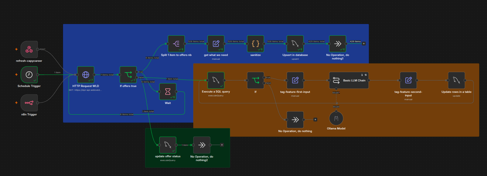

## Stratégie d'ingestion de données (n8n)

* **Décision :** Implémentation d'un flux n8n pour l'ETL (Extraction, Transformation, Chargement) des offres de la source obligatoire.

* **Why (Pourquoi) :** L'intégration de l'API WeLoveDevs est requise. Plutôt que de développer un script d'ingestion codé manuellement nécessitant la gestion complexe de la pagination, de l'orchestration et des délais réseau, n8n propose des nœuds visuels (ex: le nœud "Wait") pour gérer nativement et facilement la stricte limite de débit imposée.

* **How (Comment) :** Déploiement d'une instance n8n conteneurisée. Construction d'un workflow qui normalise les données avant le stockage. L'exigence de déclenchement manuel est gérée via un nœud Webhook appelable par le frontend. La sécurité est assurée par le gestionnaire de "Credentials" intégré pour éviter de coder la clé API en dur.

* **Trade-off (Compromis) :** L'ajout de n8n introduit un service applicatif supplémentaire dans l'infrastructure Docker, augmentant la consommation globale de mémoire RAM par rapport à un script Node.js dédié uniquement à cette tâche.

* **Preuves :** Fichier JSON d'export du workflow n8n (sans les clés secrètes) dans le dépôt, et capture d'écran du pipeline en cours d'exécution.

